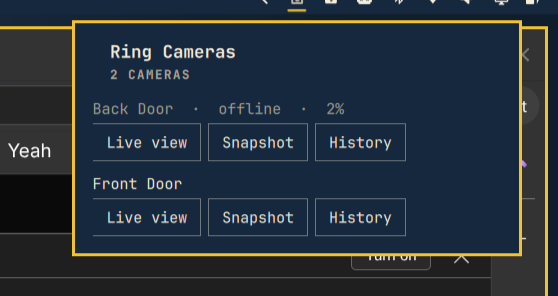

# omarchy-ring-cameras

Local Ring camera browser for the Omarchy desktop. Lists your Ring cameras
in a bar dropdown and opens a live view (in `mpv`), a snapshot, or recent
event history (motion/ding/on-demand clips, also played in `mpv`) on demand.

The panel lives at `~/.config/omarchy/plugins/ring-cameras/` (bar icon +
dropdown, id `tim.ring-cameras`). This directory is the daemon it talks to.



## How it works

- `src/creds.mjs` — stores your Ring `refreshToken` in
  `~/.local/share/omarchy-ring-cameras/creds.json`, mode 0600. Plain file,
  no passphrase vault: a Ring refresh token is a session credential (like an
  AWS/gh CLI token), not a signing key, so filesystem permissions are the
  chosen trust boundary rather than encryption-at-rest with an unlock step.
- `src/daemon.mjs` — the long-running process. Wraps
  [`ring-client-api`](https://github.com/dgreif/ring), exposes a control
  protocol over a Unix socket
  (`~/.local/state/omarchy/ring-cameras/control.sock`, mode 0600), and
  persists the refresh token every time Ring rotates it
  (`onRefreshTokenUpdated`) so restarts don't need a re-login.
- Live view: `camera.streamVideo()` spawns ffmpeg internally and hands the
  daemon raw MPEG-TS bytes via `stdoutCallback`, which get piped straight
  into an `mpv -` window. One live view at a time — starting a new one
  stops whatever was already playing.
- Snapshot: `camera.getSnapshot()` writes a JPEG to
  `~/.local/state/omarchy/ring-cameras/snapshots/` and the panel opens it
  with `xdg-open`.
- History: `camera.videoSearch({ dateFrom, dateTo, order })` lists recent
  events (last 48 hours, capped at 30) with a directly playable URL per
  clip — no ffmpeg piping needed, just `mpv <url>`, since these are plain
  HTTPS mp4s. Those URLs are presigned and expire in ~15 minutes (Ring sets
  `X-Amz-Expires=900`), so the panel fetches a fresh list each time you
  open the history section rather than caching it.
- Motion notifications: `RingCamera` auto-subscribes itself to Ring's push
  (ding/motion) stream on construction, and `RingApi` auto-registers the
  push receiver too — both using Ring's own embedded Android-app Firebase
  credentials, no setup needed on our end. The daemon listens on each
  camera's `onNewNotification`, and on a motion event fires
  `notify-send -A "default=View clip" ...`, which blocks and prints the
  chosen action to stdout — clicking the notification body plays the clip
  in `mpv`; dismissing/ignoring it does nothing further. Motion→clip
  resolution tries `camera.getRecordingUrl(dingId)` first (targets Ring's
  short-lived "recent dings" feed) and falls back to a `videoSearch` over
  the last 15 minutes matched by ding id if that 404s — verified live that
  `getRecordingUrl` really does reject an aged-out ding ("Url not found")
  and that the `videoSearch` fallback recovers a valid URL for the exact
  same id.
- `bin/ctl.mjs` (installed as `omarchy-ring-cameras-ctl`) is a thin CLI over
  the control socket, same shape as the QML panel uses. Commands with
  secrets (`link_start`, `link_2fa`) take `--stdin` instead of a JSON argv
  payload — argv is readable by any other process on this machine via
  `/proc/<pid>/cmdline` for as long as the (short-lived) ctl process is
  alive, so the QML panel writes those to the child's stdin instead
  (`stdinEnabled: true` + `write()`, the same pattern Omarchy's own Wi-Fi
  panel uses for passphrase entry).
- `src/fetch-fix.mjs` — forces the global `fetch` to undici's own
  implementation. `ring-client-api` builds its network Agent from its own
  npm-installed `undici` dependency but calls the *global* `fetch` to use
  it as a dispatcher; on Node v26 (this machine) that global fetch is
  backed by a different internal undici version, and the mismatch doesn't
  error — it silently never dispatches the request. Without this fix,
  every login and API call hangs forever with zero network activity.
  Imported first, before any `ring-client-api` import, in both
  `daemon.mjs` and `bin/setup.mjs`.

## Setup

```bash
npm install    # already done
./install.sh   # symlinks + enables the systemd --user service
```

Then open the "Ring Cameras" bar icon (right section). If no account is
linked yet, the panel itself prompts for email/password (and a 2FA code if
your account uses it) — no terminal step needed. `bin/setup.mjs` still
exists as a CLI fallback with the same login logic, useful for debugging
from a terminal with visible output.

## Operating it

```bash
systemctl --user status omarchy-ring-cameras.service
tail -f ~/.local/state/omarchy/ring-cameras/daemon.log
omarchy-ring-cameras-ctl status
omarchy-ring-cameras-ctl list_cameras
```

## Not done yet / caveats

- **Verified against a real account**: login (both `bin/setup.mjs` and the
  in-panel form), `list_cameras`, `snapshot`, `history`, and live view have
  all been used successfully against a real Ring account (multiple
  start/stop cycles logged with no errors).
- **Motion notifications are unverified against a real event yet** — the
  daemon starts cleanly with the new subscription code, `notify-send`
  fires correctly (confirmed structurally), and the click→play resolution
  logic was verified piece-by-piece against real historical data, but
  nobody has triggered a real motion event and actually clicked the
  resulting notification end to end.
- **Playing a history clip via the panel's Play button is likewise
  unverified** — `mpv <url>` against a real presigned S3-style URL hasn't
  been watched end to end, only confirmed the URLs come back well-formed.
- If login ever fails with `Cannot use 'in' operator to search for 'error'
  in ...`, that's Ring's edge/WAF returning a plain-text (non-JSON) body,
  which the library's error formatting doesn't handle — seen once with an
  obviously-fake test email, not with the real account.
- Only one live view at a time; starting a second stops the first.
  Recording playback is independent of live view — each clip opens its own
  `mpv` window and isn't tracked or stoppable from the panel; close it like
  any other video window.
- No light/siren toggle yet, even though `RingCamera` supports both
  (`setLight`, `setSiren`) — straightforward to add to `daemon.mjs` and the
  panel if wanted.
- `package.json` pins `ring-client-api@^13.0.0`, which warns it wants Node
  18/20/22; this machine runs Node 26 via mise. The undici/fetch mismatch
  above was a direct consequence of that gap — worth assuming there could
  be others.
- `npm audit` originally reported 7 transitive vulnerabilities, all several
  layers deep inside `werift` (the WebRTC library behind live view) and
  `socket.io-client`. Triaged: `uuid` and `parseuri` had patched versions,
  now pinned via `package.json`'s `overrides` field, which fixed 4 of the
  7 — live view re-tested afterward (start, confirmed streaming, stop) to
  make sure pinning them didn't break the WebRTC signaling path, since
  that's exactly where they sit. The remaining 3 are all the same `ip`
  package SSRF advisory (counted once per dependency path): it has no
  patched version at all (`npm audit` lists it as `ip *` — every published
  version matches), so there's nothing to update to. Low real-world risk
  here regardless, since it's only used internally against Ring's own
  relay servers, never attacker-controlled input.
- The systemd unit sets `LimitCORE=0`, `NoNewPrivileges=true`, and
  `PrivateTmp=true`, but intentionally skips `ProtectHome`/`ProtectSystem`
  sandboxing (unlike a headless daemon) because it needs to spawn `mpv`
  against your live Wayland session, and doing that safely needs careful
  path allow-listing (Wayland/audio sockets under `/run/user/<uid>`, plus
  this project's own data/state dirs under `~/.local/`) that hasn't been
  worked out yet.
